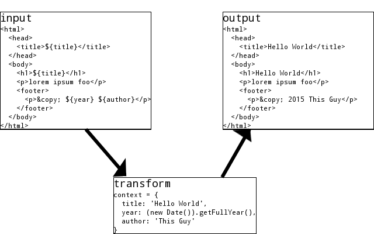

# es6-interpolate-stream
A node transform stream which performs es6-style string interpolation on it's source data.

# install
```npm install es6-interpolate-stream```

# use

This module exports a factory function, which takes a context object as its only parameter, and returns a node Transform stream. This stream reads all of its input, parses it using [babel-core](https://www.npmjs.com/package/babel-core), and replaces expressions of the form `${expression}` with the value of `context[expression]`, where `context` is the object passed to the exported factory function.

## examples
For those, like me, who like pictures, here's a diagram depicting the action of the transform on an html file:



For those, like me, who like code, suppose you have a template file:
```
// foo.template
/* ${hello} */
var bar = ${bar},
    baz = ${baz};

/* the addition will NOT be evaluated,
   unless of course the context object
   has a key '2+2'!
   So the output below will be
   "two plus two is 22", which is probably
   not what you want.
*/
console.log("two plus two is " + ${2+2});
```
and you pipe it through `es6-interpolate-stream`:
```
var interpolate = require('es6-interpolate-stream'),
    fs = require('fs'),
    context = {
      'hello': 'hello, world!',
      'bar': 5,
      'baz': function () { return 'abcdefg'; }
    };

//pipe it on through
fs.createReadStream('foo.template', {encoding: 'utf8'})
  .pipe(interpolate(context))
  .pipe(process.stdout);
```
the output should be:
```
// foo.template
/* hello, world! */
var bar = 5,
    baz = function () { return 'abcdefg'; };

/* the addition will NOT be evaluated,
   unless of course the context object
   has a key '2+2'!
   So the output below will be
   "two plus two is 22", which is probably
   not what you want.
*/
console.log("two plus two is " + 2+2);

```
The above example can be run from the [`test/` directory](https://github.com/phoenixstormcrow/es6-interpolate-stream/tree/master/test), with `node foo.js`.
A more [practical example](https://github.com/phoenixstormcrow/es6-interpolate-stream/blob/master/test/template.js) is the template file `test/template.js` used for running the actual test, which is the use-case which prompted the creation of this module, viz: a boilerplate generator for creating custom html elements. That project is [web-component](https://github.com/phoenixstormcrow/web-component), check it out.
